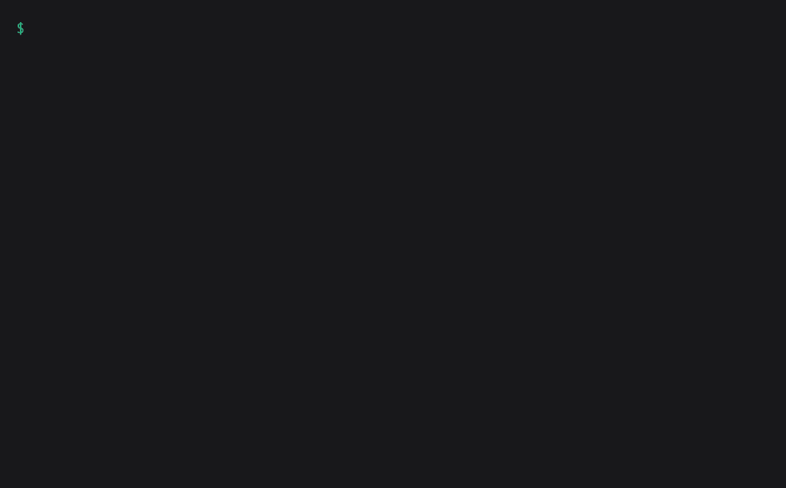

# sandbox

> **Disposable, isolated Linux dev sandboxes (rootless Podman containers or Firecracker microVMs on
> one shared network) for running AI coding agents.**

[](LICENSE)


`cs-sandbox` is a single script that creates and manages these sandboxes. Each one is a rootless
Linux environment built from a single image, with a modern toolchain and the **Claude Code** &
**Codex** agents preinstalled. Spin up many named sandboxes, reach each by name over SSH, and share
**only** the repos or directories you choose. Nothing on your host is shared unless you ask. The loop
is **create → work → fetch → destroy**.

<p align="center">
  
</p>

<p align="center"><sub><i>Walkthrough&nbsp;1, end to end. Source cast: <a href="docs/demo.cast">docs/demo.cast</a> (<code>asciinema play docs/demo.cast</code>).</i></sub></p>

## Contents

- [How it fits together](#how-it-fits-together)
- [Before you start](#before-you-start) · one-time install + sign-in ([INSTALL.md](INSTALL.md))
- [Walkthroughs](#walkthroughs) · the fastest way to get a feel for it
- [Choosing an engine](#choosing-an-engine-podman-vs-firecracker)
- [SSH trust](#ssh-trust) · [Security model](#security-model) · [Docs](#docs)

## How it fits together

You drive everything from your host with the `cs-sandbox` CLI. Each sandbox runs on one of two
engines (a Podman container or a Firecracker microVM) but they all join a single shared network, so
every sandbox is reachable by name. You share data into a sandbox explicitly, as a git repo
or a frozen snapshot, and pull commits back out. The diagram below traces that: the
host on top, the shared network holding the sandboxes, and how data moves in and out.

```
   your host:  cs-sandbox CLI  +  cs-claude / cs-codex   (signed in once)
               create · fetch · push · forward · host-route
                                   │
                        ssh <name> │ forward · host-route
                                   ▼
   ┌──────────────── shared rootless network ─────────────────────┐
   │            sandboxes reach each other by name, any engine     │
   │                                                               │
   │   ┌─ box-a ──────────────┐       ┌─ box-b ──────────────┐     │
   │   │ Podman container     │  ssh  │ Firecracker microVM  │     │
   │   │ shares host kernel   │ ◀───▶ │ own guest kernel     │     │
   │   │ cs-claude / cs-codex │       │ cs-claude / cs-codex │     │
   │   │ ~/<repo>  (opt-in)   │       │ ~/<repo>  (opt-in)   │     │
   │   └──────────────────────┘       └──────────────────────┘     │
   └───────────────────────────────────────────────────────────────┘

   host data in:  --repo · --snapshot        commits out:  fetch
```

Every sandbox runs from one generic image (no identity baked in; your user is created at first
boot). A shared rootless network joins them all, so any sandbox reaches any other **by name**, across
engines. The host reaches a sandbox by name over SSH, and a port inside a sandbox via `forward` or the
optional `host-route`.

## Before you start

The walkthroughs below assume a one-time host setup: install Podman (and, on Linux, the
Firecracker/KVM packages), build the image, put the host helpers on your PATH, and **sign in once to
the Claude Code and Codex coding agents** (on the host). It's a handful of commands - see
**[INSTALL.md](INSTALL.md)** (and `./cs-sandbox doctor` checks every prerequisite for you). That one
host sign-in is inherited by every sandbox, so in the walkthroughs `cs-claude` and `cs-codex` just
work, with no login step inside the sandbox.

## Walkthroughs

Each block is runnable end to end (4 and 5 continue from 3). Skim the comments to get the gist; run
them when you want to play.

### 1. Share two repos, let an agent edit one, pull the changes out

Two repos go into one agent sandbox; the agent edits one, and you fetch its commits back.

```bash
# Each repo lands at ~/<basename> on its own branch  cs-sandbox/<sandbox-name>.
./cs-sandbox create feature --repo ~/projects/api --repo ~/projects/web

# shell in, by name
ssh feature
# Launch Claude - already signed in (it inherits your host login).
[feature]$ cd ~/api && cs-claude
# then type a prompt like "add a /version endpoint and commit when done"
# ...let it work, then exit Claude
[feature]$ exit

# Pull the agent's commits back to the host (its branch: cs-sandbox/feature).
./cs-sandbox fetch feature

# Done with it? Throw the whole sandbox away.
./cs-sandbox destroy feature
```

### 2. An isolated experiment (`--yolo --solo`) → a live HTTP API

A throwaway `--yolo --solo` playground where the agent builds and runs a small HTTP API you hit from inside the sandbox.

```bash
#   --yolo  agent works with no approval prompts (the sandbox is the boundary)
#   --solo  agent can't SSH out to your other sandboxes (it stays reachable)
./cs-sandbox create lab --yolo --solo

ssh lab
[lab]$ cs-claude
# then type a prompt like "run a tiny HTTP API on port 8000 in the background"
# ...let it work, then exit Claude

# Hit the API from inside the sandbox.
[lab]$ curl http://localhost:8000
```

### 3. Run an app inside a nested Podman container

Run a ready-made container one layer deeper - inside the sandbox - and hit it from inside (nested Podman just works).

```bash
./cs-sandbox create web

ssh web
# Run stock nginx in a nested container, on the sandbox's port 8080.
[web]$ podman run -d -p 8080:80 docker.io/library/nginx
# Hit it from inside the sandbox (nginx's welcome page).
[web]$ curl http://localhost:8080
[web]$ exit
```

### 4. Reach a sandbox port from the host with `forward`

Continuing from walkthrough 3 (the `web` sandbox running nginx): forward a host port to it - no sudo, both engines, works on macOS.

```bash
# host :9000  ->  web's :8080
./cs-sandbox forward web 9000:8080
curl http://localhost:9000

# See what's wired up, then tear the forward down.
./cs-sandbox forwards web
./cs-sandbox unforward web all
```

### 5. Reach a sandbox by name from the host with `host-route`

Continuing from walkthrough 3: an optional, Linux-only convenience (one-time sudo) that lets the host reach **any** sandbox port directly by name - no per-port forward.

```bash
./cs-sandbox host-route up                 # one-time, host-side; needs sudo

# Reach web's nginx from the host by name, on whatever port it bound.
curl http://web.cs.sandbox:8080

./cs-sandbox host-route down               # remove it when done
./cs-sandbox destroy web                   # done with the walkthrough-3 sandbox
```

### 6. One AI coding agent driving another, in a second sandbox

One agent in a sandbox drives a second agent in another sandbox, over the built-in remote-delegation tooling.

```bash
# Two agent sandboxes. Agents can SSH to each other
# (but never into your user sandboxes).
./cs-sandbox create driver
# worker holds the repo to work on
./cs-sandbox create worker --repo ~/projects/api

ssh driver
[driver]$ cs-claude
# then type a prompt like:
#   "Run a codex session on worker to add a /health route and run it"
#
# That's all - Claude knows the remote tooling. Under the hood it runs these
# on driver (you can run them by hand too, to see the mechanism):
#   cs-codex-remote --new --name add-health -H worker "add /health, run it"
#   cs-codex-remote-output add-health   # see what codex did on worker
```

> Both agents share your single host sign-in, so Codex on `worker` is already authenticated.
> `cs-claude-remote` is the mirror of `cs-codex-remote`; either agent can drive either, on any host.

## Choosing an engine: Podman vs Firecracker

Both engines work the same way for almost everything: same image, trust model, sharing flags, and
shared network. They differ mostly in isolation versus weight. Pick with `--engine podman|firecracker`.

| | **Podman container** | **Firecracker microVM** |
|---|---|---|
| Isolation | shares the host kernel, scaled-down capabilities | **own kernel**, hardware virtualization |
| Root inside | rootful-in-userns (sudo wrapper) | **real root** |
| Nested Podman | via a rootful-inside wrapper | native |
| Requires | Podman | `/dev/kvm`, Linux x86_64 |
| Default on | macOS / non-KVM hosts | Linux + KVM |
| **Reach for it when** | speed, macOS | stronger isolation, untrusted workloads, nested root |
| Deep dive | [`docs/podman.md`](docs/podman.md) | [`docs/firecracker.md`](docs/firecracker.md) |

## SSH trust

Every sandbox runs an SSH server, so you reach each one by name. What a sandbox can reach in turn
depends on its **type**, set with `--type` (independent of engine): you (and your user sandboxes) can
`ssh` into either type, but an agent sandbox can never `ssh` in as you.

- **user sandbox** (`--type user`): yours. Gets a one-time copy of your host `~/.ssh`, so git-over-SSH
  works as on the host, and it can `ssh` into **every** sandbox.
- **agent sandbox** (default): one you hand to a coding agent. Its own home, **no** host SSH keys; it
  can `ssh` only into **other agent sandboxes**, never into a user sandbox.

| client ↓ \ server → | user sandbox | agent sandbox |
|---|:---:|:---:|
| **host** | ✓ | ✓ |
| **user** sandbox | ✓ | ✓ |
| **agent** sandbox | ✗ | ✓ |

So you and your user sandboxes reach everything, but a coding agent can never `ssh` into a sandbox
that holds your host keys.

## Security model

- **The boundary is the engine.** A Podman container shares the host kernel; a Firecracker microVM
  boots its own kernel under hardware virtualization, the stronger choice for untrusted or
  autonomous work.
- **Nothing shared by default.** Host data enters a sandbox only through `--repo` (a git checkout)
  or `--snapshot` (a frozen read-only copy). Results come back out with `cs-sandbox fetch`.
- **Agent vs user isolation.** The [SSH trust](#ssh-trust) rules are enforced per type, so an agent
  can't pivot through SSH into a sandbox that carries your host keys.
- **`--yolo`** (agent sandboxes) drops the agents' approval prompts, safe because the sandbox itself
  is the isolation boundary. **`--solo`** additionally denies the agent any *outbound* SSH into the
  fabric, while keeping it reachable for you to drive.
- It is not a hardened multi-tenant boundary; isolation is whatever the chosen engine provides.

## Docs

- [`INSTALL.md`](INSTALL.md): one-time host setup. Podman, the Firecracker/KVM prerequisites,
  building the image, host helpers, and agent sign-in.
- [`docs/design.md`](docs/design.md): the cross-engine model (types & trust, networking, the generic
  image, the seed, shared image stores, agent tooling & auth, security).
- [`docs/podman.md`](docs/podman.md): the Podman container engine (boot, nested Podman, storage, macOS).
- [`docs/firecracker.md`](docs/firecracker.md): the Firecracker microVM engine.
- [`docs/repo-sharing.md`](docs/repo-sharing.md): the `--repo` checkout / fetch / push model.

`./cs-sandbox help` is the full command reference.

## License

[Apache-2.0](LICENSE).
