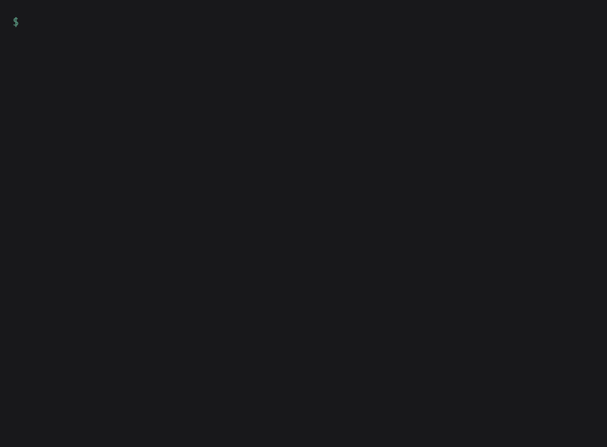

# sandbox

> **Disposable, isolated Linux dev sandboxes (rootless Podman containers or Firecracker microVMs on
> one shared network) for running AI coding agents.**

[](LICENSE)


`cs-sandbox` is a single Go binary that creates and manages these sandboxes. Each one is a rootless
Linux environment built from a single image, with a modern toolchain and the **Claude Code** &
**Codex** agents preinstalled. Spin up many named sandboxes, reach each by name over SSH, and share
**only** the repos or directories you choose. Nothing on your host is shared unless you ask. The loop
is **create → work → fetch → destroy**.

<p align="center">
  
</p>

<p align="center"><sub><i>Walkthrough&nbsp;1, end to end. Source cast: <a href="docs/demo.cast">docs/demo.cast</a> (<code>asciinema play docs/demo.cast</code>).</i></sub></p>

## Contents

- [Quickstart](#quickstart)
- [How it fits together](#how-it-fits-together)
- [Before you start](#before-you-start) · one-time install + sign-in ([INSTALL.md](INSTALL.md))
- [Walkthroughs](#walkthroughs) · the fastest way to get a feel for it
- [Choosing an engine](#choosing-an-engine-podman-vs-firecracker)
- [SSH trust](#ssh-trust) · [Security model](#security-model) · [Docs](#docs)
- [Contributing](#contributing)

## Quickstart

One-time host setup (get the binary, Podman, `build`, `install-agent-tools`, sign in once) is in
**[INSTALL.md](INSTALL.md)** — then the whole loop is:

```bash
cs-sandbox create feature --repo ~/projects/api   # spin up a sandbox with your repo, on its own branch
ssh feature                                        # shell in by name
[feature]$ cd ~/api && cs-claude                   # run the agent — already signed in; then exit
cs-sandbox fetch feature                           # pull the agent's commits back to the host
cs-sandbox destroy feature -f                      # throw the whole sandbox away
```

The [Walkthroughs](#walkthroughs) below unpack this and the rest (user sandboxes, `--yolo --solo`,
nested Podman, port forwarding, agents driving agents).

## How it fits together

You drive everything from your host with the `cs-sandbox` CLI. Each sandbox runs on one of two
engines (a Podman container or a Firecracker microVM) but they all join a single shared network, so
every sandbox is reachable by name. You share data into a sandbox explicitly, as a git repo
or a frozen snapshot, and pull commits back out. The diagram below traces that: the
host on top, the shared network holding the sandboxes, and how data moves in and out.

```
   your host:  cs-sandbox CLI  +  cs-claude / cs-codex   (signed in once)
               create · fetch · push · forward · host-route
                                   │
                        ssh <name> │ forward · host-route
                                   ▼
   ┌──────────────── shared rootless network ─────────────────────┐
   │            sandboxes reach each other by name, any engine     │
   │                                                               │
   │   ┌─ box-a ──────────────┐       ┌─ box-b ──────────────┐     │
   │   │ Podman container     │  ssh  │ Firecracker microVM  │     │
   │   │ shares host kernel   │ ◀───▶ │ own guest kernel     │     │
   │   │ cs-claude / cs-codex │       │ cs-claude / cs-codex │     │
   │   │ ~/<repo>  (opt-in)   │       │ ~/<repo>  (opt-in)   │     │
   │   └──────────────────────┘       └──────────────────────┘     │
   └───────────────────────────────────────────────────────────────┘

   host data in:  --repo · --snapshot        commits out:  fetch
```

Every sandbox runs from one generic image (no identity baked in; your user is created at first
boot). A shared rootless network joins them all, so any sandbox reaches any other **by name**, across
engines. The host reaches a sandbox by name over SSH, and a port inside a sandbox via `forward` or the
optional `host-route`.

## Before you start

The walkthroughs below assume a one-time host setup: **get the `cs-sandbox` binary** (download a
release, or build it — Go 1.25+, `make build`) and put it on your PATH, install Podman (and, on Linux,
the Firecracker/KVM packages), run `cs-sandbox build` (sets up the image and, on Linux/KVM, the
Firecracker artifacts), run `cs-sandbox install-agent-tools` (puts the agent tools on your PATH),
and **sign in once to the Claude Code and Codex coding agents** (on the host). It's a handful of
commands - see **[INSTALL.md](INSTALL.md)** (and `cs-sandbox doctor` checks every prerequisite for
you). That one host sign-in is inherited by every sandbox, so in the walkthroughs `cs-claude` and
`cs-codex` just work, with no login step inside the sandbox. (To create a sandbox that does *not* inherit
it, pass `create --no-agent-auth` — see [auth carry](docs/design.md#bundled-agent-tooling-and-auth).)

## Walkthroughs

Each block is runnable end to end (5 and 6 continue from 4). Skim the comments to get the gist; run
them when you want to play.

### 1. Share two repos, let an agent edit one, pull the changes out

Two repos go into one agent sandbox; the agent edits one, and you fetch its commits back.

```bash
# Each repo lands at ~/<basename> on its own branch  cs-sandbox/<sandbox-name>.
cs-sandbox create feature --repo ~/projects/api --repo ~/projects/web

# shell in, by name
ssh feature
# Launch Claude - already signed in (it inherits your host login).
[feature]$ cd ~/api && cs-claude
# then type a prompt like "add a /version endpoint and commit when done"
# ...let it work, then exit Claude
[feature]$ exit

# Pull the agent's commits back to the host (its branch: cs-sandbox/feature).
cs-sandbox fetch feature

# Done with it? Throw the whole sandbox away (-f skips the confirmation prompt).
cs-sandbox destroy feature -f
```

### 2. Fetch an agent's work into a user sandbox

Same idea as walkthrough 1, but the destination is a **user sandbox** you drive rather than the host.
A user sandbox sits a layer above and can `ssh` into agent sandboxes, so it fetches a peer's branch
with plain git — no host round-trip.

```bash
# An agent sandbox does the work (its branch: cs-sandbox/worker).
cs-sandbox create worker --repo ~/projects/api
ssh worker
[worker]$ cd ~/api && cs-claude    # "add a /health endpoint and commit when done", then exit
[worker]$ exit

# A user sandbox with the same repo — your workspace to review the agent's work.
cs-sandbox create dev --type user --repo ~/projects/api
ssh dev
[dev]$ cd ~/api
# Fetch the agent's branch straight from the agent sandbox, by name.
[dev]$ git fetch worker:api cs-sandbox/worker
[dev]$ git log --oneline FETCH_HEAD    # the agent's commits; merge/cherry-pick as usual
[dev]$ exit

cs-sandbox destroy worker -f && cs-sandbox destroy dev -f
```

### 3. An isolated experiment (`--yolo --solo`) → a live HTTP API

A throwaway `--yolo --solo` playground where the agent builds and runs a small HTTP API you hit from inside the sandbox.

```bash
#   --yolo  agent works with no approval prompts (the sandbox is the boundary)
#   --solo  agent can't SSH out to your other sandboxes (it stays reachable)
cs-sandbox create lab --yolo --solo

ssh lab
[lab]$ cs-claude
# then type a prompt like "run a tiny HTTP API on port 8000 in the background"
# ...let it work, then exit Claude

# Hit the API from inside the sandbox.
[lab]$ curl http://localhost:8000
```

### 4. Run an app inside a nested Podman container

Run a ready-made container one layer deeper - inside the sandbox - and hit it from inside (nested Podman just works).

```bash
cs-sandbox create web

ssh web
# Run stock nginx in a nested container, on the sandbox's port 8080.
[web]$ podman run -d -p 8080:80 docker.io/library/nginx
# Hit it from inside the sandbox (nginx's welcome page).
[web]$ curl http://localhost:8080
[web]$ exit
```

### 5. Reach a sandbox port from the host with `forward`

Continuing from walkthrough 4 (the `web` sandbox running nginx): forward a host port to it - no sudo, both engines, works on macOS.

```bash
# host :9000  ->  web's :8080
cs-sandbox forward web 9000:8080
curl http://localhost:9000

# See what's wired up, then tear the forward down.
cs-sandbox forwards web
cs-sandbox unforward web all
```

### 6. Reach a sandbox by name from the host with `host-route`

Continuing from walkthrough 4: an optional, Linux-only convenience (one-time sudo) that lets the host reach **any** sandbox port directly by name - no per-port forward.

```bash
cs-sandbox host-route up                 # one-time, host-side; needs sudo

# Reach web's nginx from the host by name, on whatever port it bound.
curl http://web.cs.sandbox:8080

cs-sandbox host-route down               # remove it when done
cs-sandbox destroy web -f                # done with the walkthrough-4 sandbox
```

### 7. One AI coding agent driving another, in a second sandbox

One agent in a sandbox drives a second agent in another sandbox, over the built-in remote-delegation tooling.

```bash
# Two agent sandboxes. Agents can SSH to each other
# (but never into your user sandboxes).
cs-sandbox create driver
# worker holds the repo to work on
cs-sandbox create worker --repo ~/projects/api

ssh driver
[driver]$ cs-claude
# then type a prompt like:
#   "Run a codex session on worker to add a /health route and run it"
#
# That's all - Claude knows the remote tooling. Under the hood it runs these
# on driver (you can run them by hand too, to see the mechanism):
#   cs-codex-remote --new --name add-health -H worker "add /health, run it"
#   cs-codex-remote-output add-health   # see what codex did on worker
```

> Both agents share your single host sign-in, so Codex on `worker` is already authenticated.
> `cs-claude-remote` is the mirror of `cs-codex-remote`; either agent can drive either, on any host.

## Choosing an engine: Podman vs Firecracker

Both engines work the same way for almost everything: same image, trust model, sharing flags, and
shared network. They differ mostly in isolation versus weight. Pick with `--engine podman|firecracker`.

| | **Podman container** | **Firecracker microVM** |
|---|---|---|
| Isolation | shares the host kernel, scaled-down capabilities | **own kernel**, hardware virtualization |
| Root inside | rootful-in-userns (sudo wrapper) | **real root** |
| Nested Podman | via a rootful-inside wrapper | native |
| Requires | Podman | `/dev/kvm`, Linux x86_64 |
| Default on | macOS / non-KVM hosts | Linux + KVM |
| **Reach for it when** | speed, macOS | stronger isolation, untrusted workloads, nested root |
| Deep dive | [`docs/podman.md`](docs/podman.md) | [`docs/firecracker.md`](docs/firecracker.md) |

## SSH trust

Every sandbox runs an SSH server, so you reach each one by name. What a sandbox can reach in turn
depends on its **type**, set with `--type` (independent of engine): you (and your user sandboxes) can
`ssh` into either type, but an agent sandbox can never `ssh` in as you.

- **user sandbox** (`--type user`): yours, to work in interactively. **No** host keys are copied in;
  it has its own home and can `ssh` into **every** sandbox. (If it ever needs your own keys inside it,
  you can lend them for a session — see [below](#lending-a-sandbox-specific-ssh-keys-with-ssh--a).)
- **agent sandbox** (default): one you hand to a coding agent. Its own home, **no** host SSH keys; it
  can `ssh` only into **other agent sandboxes**, never into a user sandbox.

It's convenient to think of these as **two layers**: a user sandbox can `ssh` into any sandbox (user
or agent), while an agent sandbox can `ssh` only into other agent sandboxes — never back into a user
sandbox. Aside from that SSH direction the two types are identical (same image, same capabilities).
Typically you spawn one user sandbox and oversee the work running across several agent sandboxes from
there.

| client ↓ \ server → | user sandbox | agent sandbox |
|---|:---:|:---:|
| **host** | ✓ | ✓ |
| **user** sandbox | ✓ | ✓ |
| **agent** sandbox | ✗ | ✓ |

So you and your user sandboxes reach everything, but a coding agent can never `ssh` into a user
sandbox. That unreachability is one half of what makes it safe to lend a user sandbox your keys
(below); the other half is trusting whoever is working in it for the session.

### Lending a sandbox specific SSH keys with `ssh -A`

Agent forwarding isn't a property of any sandbox type — it's a general, opt-in technique you apply
deliberately when a sandbox needs to reach an SSH-protected resource (e.g. git-over-SSH to a private
host). You can forward a controlled, specific set of your host keys for the session with
`ssh -A <name>`, without copying any key into the sandbox — the keys stay on the host. What makes a
given use *safe* is a per-situation judgment, not the type name. Keep both conditions in mind:

- **Scope the keys.** Load only the key you need into your agent (`ssh-add -c` prompts on the host
  for each use), rather than exposing your whole keyring.
- **Trust the operator.** Only forward into a sandbox whose operator you trust for the duration of
  the session, because while you're connected anything running as you there can *use* the forwarded
  socket (it can't copy the key out). A user sandbox is the natural fit: you drive it yourself, and
  the agent fabric can't `ssh` into it — but the trust judgment, not the type label, is what makes
  it safe.

## Security model

- **The boundary is the engine.** A Podman container shares the host kernel; a Firecracker microVM
  boots its own kernel under hardware virtualization, the stronger choice for untrusted or
  autonomous work.
- **Nothing shared by default.** Host data enters a sandbox only through `--repo` (a git checkout)
  or `--snapshot` (a frozen read-only copy). Results come back out with `cs-sandbox fetch`.
- **No host SSH keys in any sandbox.** Neither type receives a copy of your host keys; sandboxes
  reach each other with generated per-tier keys. If a sandbox ever needs your own keys, you can lend
  a specific set for a session ([`ssh -A`](#lending-a-sandbox-specific-ssh-keys-with-ssh--a)) — they
  stay on the host.
- **Agent/user SSH isolation.** Per-type [SSH trust](#ssh-trust) (the "two layers, user above agent"
  model) is enforced: a user sandbox can `ssh` into any sandbox, but an agent sandbox reaches only
  other agent sandboxes — never a user sandbox — so an agent can't pivot through SSH into your
  workspace.
- **`--yolo`** (agent sandboxes) drops the agents' approval prompts, safe because the sandbox itself
  is the isolation boundary. **`--solo`** additionally denies the agent any *outbound* SSH into the
  fabric, while keeping it reachable for you to drive.
- It is not a hardened multi-tenant boundary; isolation is whatever the chosen engine provides.

## Docs

- [`INSTALL.md`](INSTALL.md): one-time host setup. Podman, the Firecracker/KVM prerequisites,
  building the image, installing the agent tools, and agent sign-in.
- [`docs/design.md`](docs/design.md): the cross-engine model (types & trust, networking, the generic
  image, the seed, shared image stores, agent tooling & auth, security).
- [`docs/podman.md`](docs/podman.md): the Podman container engine (boot, nested Podman, storage, macOS).
- [`docs/firecracker.md`](docs/firecracker.md): the Firecracker microVM engine.
- [`docs/repo-sharing.md`](docs/repo-sharing.md): the `--repo` checkout / fetch / push model.

`cs-sandbox help` is the full command reference.

## Contributing

Bug reports and pull requests are welcome. Run `make check` (formatting, `go vet`, unit tests)
before opening one. For a security-sensitive issue, please ask for a private contact rather than
posting details in a public issue.

**Testing.** `make test` runs the unit suite; `make test-integration` runs the live tests against a
real podman/Firecracker host (each skips gracefully when podman or the image is unavailable). See
[design.md → Testing](docs/design.md#testing).

## License

[Apache-2.0](LICENSE).
